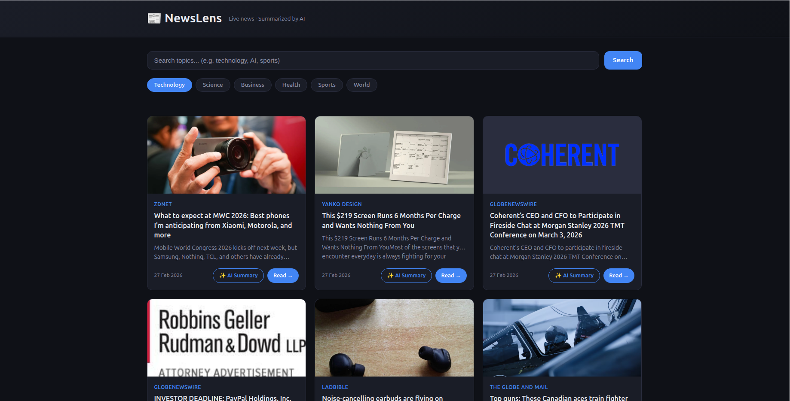

# 📰 NewsLens — AI News Aggregator & Personalized Digest App

> Live news aggregation powered by REST APIs, on-demand AI summarization via Google Gemini API, and personalized recommendations using sentence-transformer embeddings.


---

## 🚀 Features

- 🔍 **Live News Feed** — fetches real-time articles via NewsAPI REST endpoint  
- 🎨 **Responsive UI** — mobile-first CSS Grid/Flexbox layout across all devices  
- ⚡ **Real-time Search** — instant DOM-level filtering  
- 🤖 **AI Summarization** — one-paragraph summaries via Google Gemini API  
- 📌 **Skeleton Loading States** — smooth, professional UX  
- 🔗 **Personalized Recommendations** *(coming soon)* — embeddings + ChromaDB vector store  

---

## 🛠️ Tech Stack

| Layer | Technology |
|-------|-----------|
| Frontend | HTML5 (semantic), CSS3 (Grid, Flexbox, Media Queries), JavaScript ES6+ |
| APIs | NewsAPI (REST), Google Gemini API |
| DOM | Vanilla JS — createElement, appendChild, Fetch API |
| AI/ML | Gemini 2.5 Flash, sentence-transformers, ChromaDB |
| Dev Tools | Git (feature branching, PR flow), VS Code |

---

## 📁 Project Structure
NewsLens-AI-News-Aggregator---Personalized-Digest-App/
├── index.html # Semantic HTML5 structure
├── style.css # Responsive CSS3 — mobile-first
├── app.js # DOM manipulation, API fetches, OOP classes
├── server.py # Flask backend proxy — secures API keys
├── recommendations.py # Embeddings + ChromaDB microservice
├── requirements.txt # Python dependencies
├── .env.example # Template for API keys
├── .gitignore # Ignore rules
├── LICENSE # MIT License
└── README.md # Documentation


---

## ⚙️ Setup & Running Locally

### Prerequisites
- Modern browser (Chrome / Firefox / Edge)
- [NewsAPI key](https://newsapi.org/register)
- [Google Gemini API key](https://aistudio.google.com/app/apikey)
- Python 3.10+ *(for backend + recommendations)*

### 1. Clone the repo
```bash
git clone git@github.com:Hemanthkumar04/NewsLens-AI-News-Aggregator---Personalized-Digest-App.git
cd NewsLens-AI-News-Aggregator---Personalized-Digest-App
```

### 2. Get API Keys
```bash
cp .env.example .env
# Fill in your keys in the .env file
```

### 3. Install Dependencies
```bash
python3 -m venv venv
source venv/bin/activate        # Windows: venv\Scripts\activate
pip install -r requirements.txt
```

### 4. Run the application
```bash
python server.py
Then open: http://127.0.0.1:5000
```

## 🧠 How It Works

### News Feed (REST API + DOM Manipulation)
1. On load, `fetchNews()` sends a `GET` request to NewsAPI endpoint
2. Response JSON is parsed — each article rendered as a card via `createElement()`
3. Search input fires `keyup` event → filters rendered cards in real-time via DOM traversal

### AI Summarization (Gemini API)
1. User clicks **"AI Summary"** on any article card
2. `APIClient.summarize()` sends a `POST` request to Gemini's `generateContent` endpoint
3. Engineered prompt ensures consistent tone, length, and factual grounding
4. Response text is rendered into a modal via DOM manipulation

### Architecture (OOP — ES6 Classes)
                       ┌────────────────────────────────┐
                       │           Frontend (UI)        │
                       │  HTML • CSS • JS (ES6 Classes) │
                       │  - ArticleRenderer             │
                       │  - SearchController            │
                       │  - APIClient                   │
                       └───────────────┬────────────────┘
                                       │  Fetch (JSON)
                                       ▼
                           ┌───────────┴───────────┐
                           │      Flask Backend    │
                           │       server.py       │
                           │  - Loads .env keys    │
                           │  - Proxies NewsAPI    │
                           │  - Proxies Gemini API │
                           └───────────┬───────────┘
                                       │ Secure API calls
                                       ▼
     ┌──────────────────────────────┐             ┌──────────────────────────────┐
     │           NewsAPI            │             │          Gemini API          │
     │  Live article JSON feed      │             │ AI text generation endpoint  │
     └──────────────────────────────┘             └──────────────────────────────┘


                 ┌─────────────────────────────────────────────────────┐
                 │        recommendations.py (future module)           │
                 │  sentence-transformers + ChromaDB vector store      │
                 │  Personalized user-topic embeddings                 │
                 └─────────────────────────────────────────────────────┘

## 📸 Screenshots
### Home Page


## 🗂️ Git Workflow

This project was built using a feature-branch workflow — one branch per feature, merged via pull request, simulating a real agile sprint:

```
main
├── feat/html-structure          → semantic HTML skeleton
├── feat/responsive-css          → mobile-first CSS layout
├── feat/news-api-integration    → REST API fetch + DOM rendering + search
└── feat/gemini-ai-summarization → Gemini API integration + modal UI
```

---
## 📄 License

This project is licensed under the MIT License — see [LICENSE](LICENSE) for details.

---

## 👤 Author

**Hemanth Kumar Yanda**
- GitHub: [@Hemanthkumar04](https://github.com/Hemanthkumar04)
- LinkedIn: [y-hemanth-kumar](https://linkedin.com/in/y-hemanth-kumar)
- Email: hky21.github@gmail.com